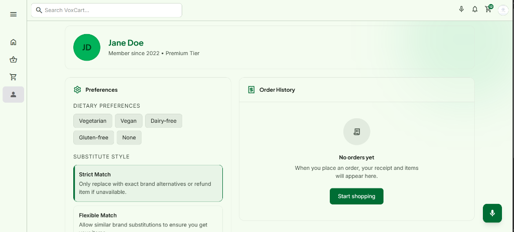
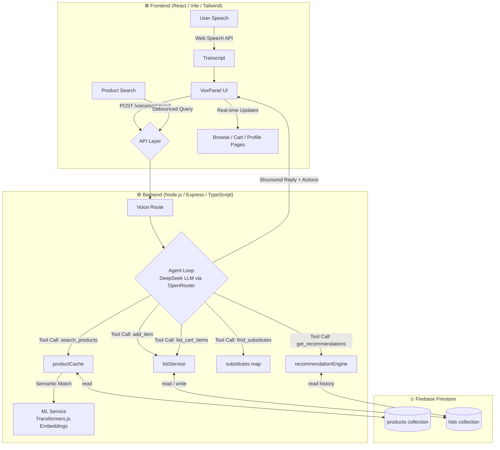

# VoxCart: Voice Command Shopping Assistant

VoxCart is a modern, voice-first shopping list manager and smart grocery assistant. It allows users to manage their shopping list, discover products, and receive smart recommendations entirely through natural voice commands.
| &nbsp; | &nbsp; |
| :---: | :---: |
|  |  |
|  |  |
|  |  |


## Architecture & Approach

**Brief Write-up:**
VoxCart is built as a responsive Single Page Application (React/Vite) paired with a Node.js/Express backend and Firebase Firestore. My approach centers on a hybrid architecture to balance natural language flexibility with transactional reliability. 

For voice comprehension, transcripts from the Web Speech API are routed through a custom Agent loop powered by DeepSeek's LLM via OpenRouter. This agent translates colloquial phrases (e.g., "I need a couple apples") into explicit tool calls (like `add_item`). 

To ensure the app feels grounded and snappy, latency-sensitive features bypass the LLM. For example, product search uses debounced Firestore queries, and alternative product substitutes are mapped using a pre-calculated dataset and local ML embeddings (`@xenova/transformers`). By decoupling the conversational AI from the strict inventory database, VoxCart achieves a highly robust, voice-first UX complete with live visual feedback, multi-language support, and smart history-based recommendations.

### System Architecture



---

## Technical Stack
- **Frontend:** React 18, Vite, Tailwind CSS, Web Speech API
- **Backend:** Node.js, Express, TypeScript, OpenRouter (DeepSeek API)
- **Database:** Firebase Firestore
- **ML / NLP:** Transformers.js (for embeddings), OpenAI Tool Calling schema

---

## Features Matrix

| Required Feature | Delivered Implementation | Status |
|---|---|---|
| **Voice Command Recognition** | Add, remove, or modify items via mic buttons (Global FAB or Voice Panel). | ✅ Done |
| **Natural Language Processing** | Handles varied phrasing via an advanced LLM agent loop (e.g. "I want to buy bananas" vs "Add bananas"). | ✅ Done |
| **Multilingual Support** | Voice recognition accepts multiple locales (hi-IN, es-ES, etc.). The LLM responds in the user's language and translates items to English for backend queries. | ✅ Done |
| **Product Recommendations** | Suggests items based on individual purchase history intervals (e.g., "Running low on..."). | ✅ Done |
| **Seasonal Recommendations** | Recommends items appropriate for the current season (e.g., Mangoes in Summer). | ✅ Done |
| **Substitutes** | Suggests semantic alternatives via ML embeddings when users ask "what can I use instead of milk?". | ✅ Done |
| **Add/Remove Items** | Full voice control over list state with toast confirmations and visual UI badges. | ✅ Done |
| **Categorize Items** | Auto-categorizes added items (Dairy, Produce, etc.) for organized list grouping. | ✅ Done |
| **Quantity Management** | Extracts exact quantities and units from speech (e.g., "Add 2 bottles of water"). | ✅ Done |
| **Item Search** | Voice-activated and typed debounced search for specific items across the catalog. | ✅ Done |
| **Price Range Filtering** | Supports voice filters like "Find me toothpaste under ₹100" mapped to backend queries. | ✅ Done |
| **Minimalist Interface** | Clean, distraction-free UI with intuitive sidebars and accessible grid layouts. | ✅ Done |
| **Visual Feedback** | Real-time transcript bubbles, thinking indicators, and toast popups provide constant state awareness. | ✅ Done |
| **Mobile/Voice-Only UX** | Responsive mobile view with a dedicated "Fullscreen Voice Mode" for hands-free operation. | ✅ Done |

---

## Local Setup Instructions

1. **Clone the repository:**
   ```bash
   git clone https://github.com/Mohit20198/Voxcart.git
   cd Voxcart
   ```

2. **Backend Setup:**
   ```bash
   npm install
   cp .env.example .env
   # Add your Firebase service account JSON string and OpenRouter API key to .env
   npm run dev
   ```

3. **Frontend Setup:**
   ```bash
   cd frontend
   npm install
   cp .env.example .env
   # Ensure VITE_API_BASE_URL points to your backend (default: http://localhost:3000/api)
   npm run dev
   ```

4. **Database Seeding (Optional):**
   To populate the catalog with the default 88 grocery items:
   ```bash
   npx tsx src/scripts/seedProducts.ts
   ```

The application will be running at `http://localhost:5173`.
